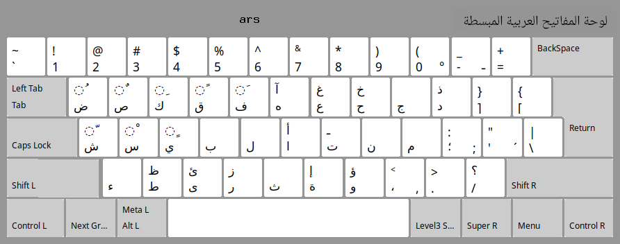

# Simplified Arabic Keyboard Layout (ars) 

## Overview

This repository provides an improved Arabic character layout on the 
**Bilingual QWERTY Arabic-English** keyboard.

The improvements implemented here aim to reduce finger movement and facilitate the memorization of character positions.

* A first simplification consists of keeping the same keys for all symbol 
characters and punctuation characters for both  
Arabic and English keyboards.
* Another simplification involves placing certain Arabic characters that 
have the same shape   
on the same key and using the `SHIFT` key.
* The Arabic vowels are arranged according to the first letter of the 
vowel's name.

> **The `"ars"` keyboard layout**

> 

## Repository Structure

```
.
├── linux/
│     └── symbols/
│           └── ars					# simplified arabic keyboard layout for linux
│     └── rules/
│           └── evdev.xml			# for GNOME, Plasma (KDE)
│     └── xsessionrc				# my ~/.xsessionrc for LXDE 
│     └── ars-variant.png			# image "ars" variant numbers : ١٢٣٤٥٦٧٨٩٠ 
├── windows/
│     └── ars-install/				# simplified arabic keyboard layout for Windows
│       └── setup.exe ...           # created using MSKLC.exe 
│     └── arsc-install/...			# "arsc" ("ars" variant) numbers : ١٢٣٤٥٦٧٨٩٠
│     └── images/ 			        # images 
├── README.md
└── ars.png                     

```

## Quick Start

To implement the `"ars"` keyboard layout 


> ### Linux

>> #### GNOME or Plasma (KDE)
1. Copy the `ars` file to `/usr/share/X11/xkb/symbols/` folder 
on your local system
2. Copy the `evdev.xml` file to 
`/usr/share/X11/xkb/rules/` folder on your local system. 
3. Run `udevadm trigger --subsystem-match=input --action=change` or reboot 
 
>> #### LXDE
1. Copy the `ars` file to `/usr/share/X11/xkb/symbols/` folder
on your local system
2. Add the command line  
 `setxkbmap "us,ars" -variant ",g" -option "grp:lwin_toggle,grp_led:caps";`  
to your `~/.xsessionrc` file.
3. Execute `xrdb -merge ~/.xsessionrc` or reboot
- Remark : for ars (variant), in 2. replace `",g"` by `",c"` 
 
> ### Windows
- Copy `ars-install/` folder and execute `setup.exe`.
- Remark : `"install/"` folder created using `Microsoft Keyboard Layout Creator` (MSKLC.exe)

## License
> This repository is licensed under `'MIT License'` unless otherwise noted. 

